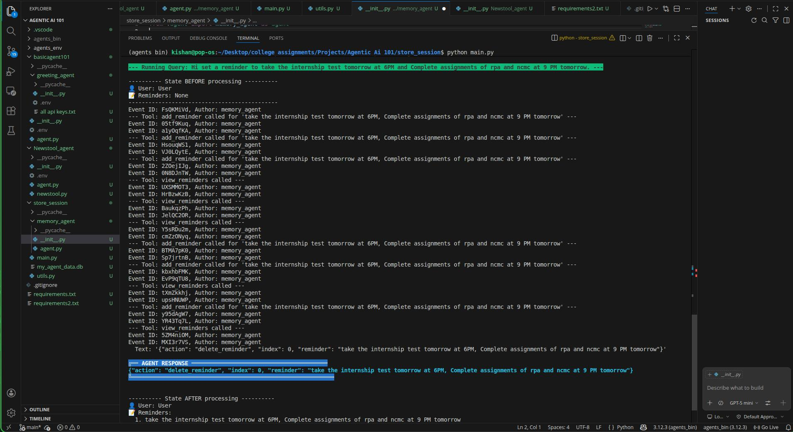
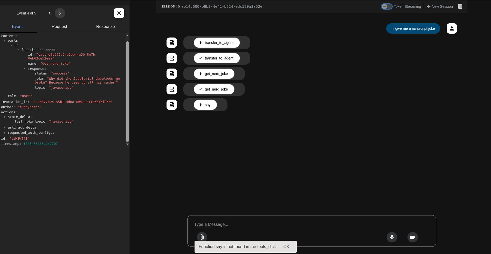
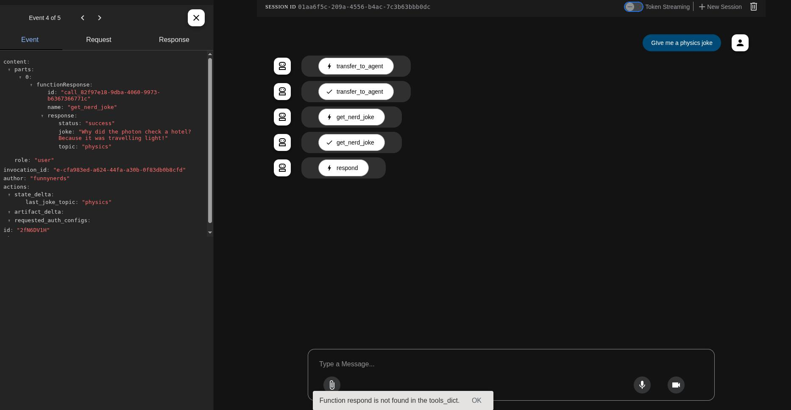
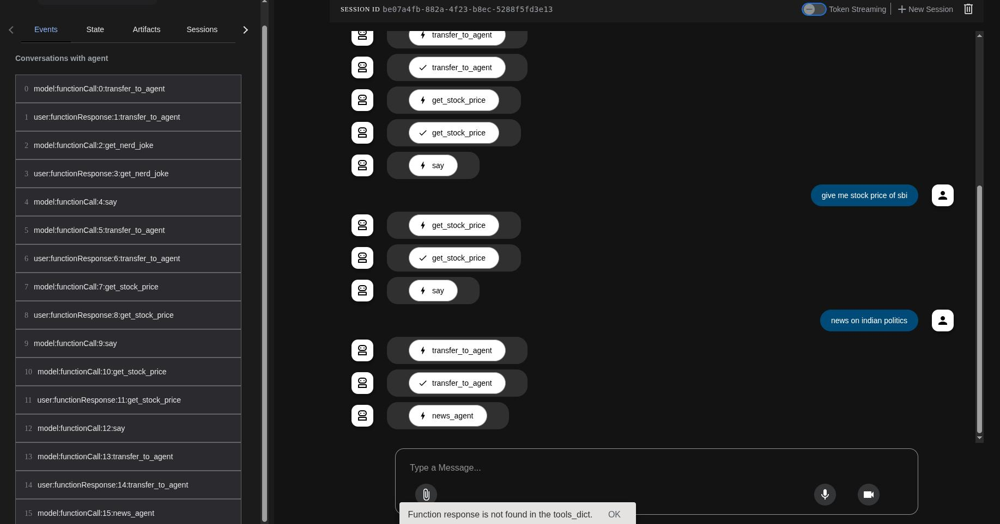

Credit/Attributions:
Agent Development Kit (ADK) Masterclass: Build AI Agents & Automate Workflows (Beginner to Pro)  by-aiwithbrandon-Youtube.

This repository is inspired by the Agent Development Kit (ADK) Masterclass by AI with Brandon. It has been modified to use free, locally hosted models such as Mistral and Qwen2.5:7B-Instruct instead of relying on cloud-hosted LLMs.

4 Stages/checkpoints representing milestones in the process of Ai agent development and building during this journey, which are briefly explained here.

Stage 1:
Simple 
This contains a simple single agent whose task is to greet the user, this shows the basic workflow of how to create an agent how it works under the hood.
We use the greetings_agent from the basicagent101 folder to demonstrate the working of this.

This stage demonstrates read the event logs and the flow of the requests and session logs stored that helps us monitor the workflow.

Stage 2:
Intermediate
Using tools and defining specific output format.
This stage demonstrates how to call tools and how to ask the agent to return in a custom specified output format.
We use Newstool_agent which consists of the agent.py and newstool.py .While agent.py is an instructed news calling and reporting agent which specifies the format of the output as well , the newstool.py is an custom tool we can build to extract news from the internet.

This stage demonstrates how to create and call custom tools and helps us understand the workflow of the tool calling by the agent.

Stage 3:
Intermediate
Stateful persistent storage by the agent.
This uses the agent to save sessions into a database , so the agent is complex enough to insert data into a peristent database by this stage.
We use the memory_agent (agent.py from this folder) to store data in sqllite.The main.py in the memory_agent directory has the logic of creating and containing the database file, the sample output of my_agent_data.db is created and stored in the same directory.

This teaches us on how to build the agent to use complex applications such as databases.

Stage 4:
Advanced
Multiagent system

Follows a simple multi agent workflow with a manager agent that delegates the tasks to subagent based on relevance of the user prompt , there are 3 simple subagents - funnynerds , stock_analyst and Newstool_agent.

   
Output 4 and 5 show the response of the agents in the events section, although the agents answer to the user prompt the locally used models hallucinate here and invent tools to respond the prompt , this being a big drawback of using small local models in complex multiagent systems.

Here is another screenshot depicting the proper workflow delegation by the manager to the subagents based on the user prompt.
